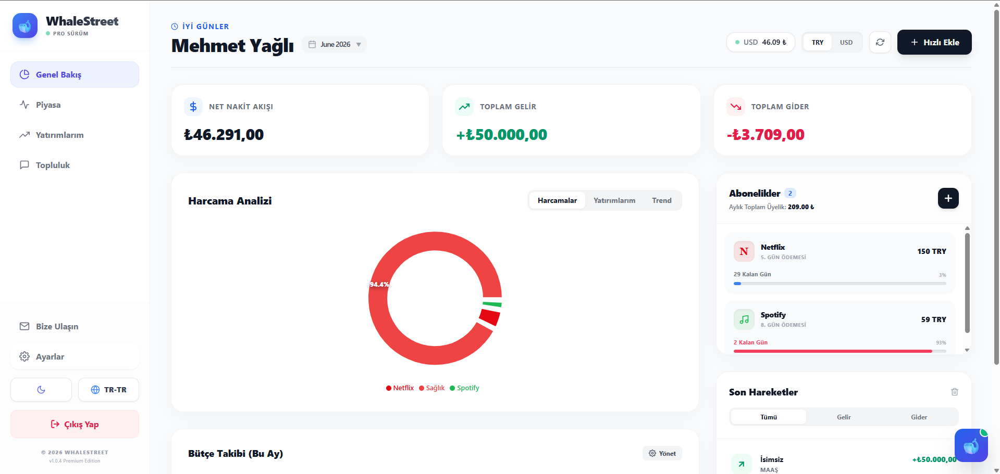
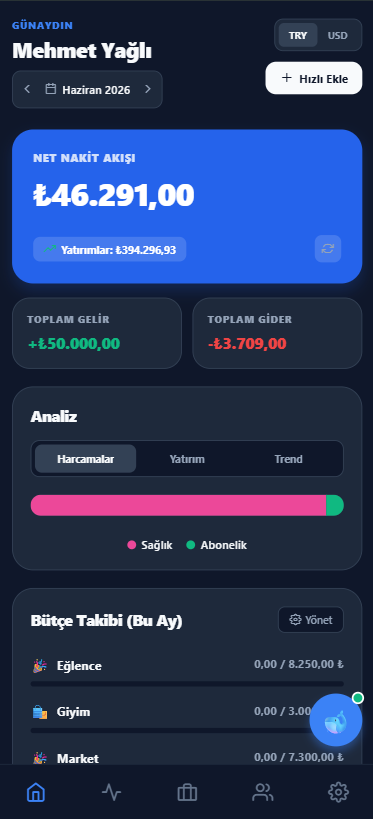
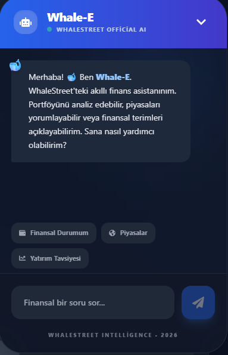

# 🐋 WhaleStreet: AI Destekli Finans & Portföy Ekosistemi

## 🌐 Canlı Erişim
- **Web Uygulaması:** [WhaleStreet'i İncele](https://finans-takip-app-nine.vercel.app/)
- **Android Uygulaması:** [WhaleStreet.apk İndir](https://github.com/mehmet-yagli/finans-takip-app/releases/latest) (Tıkla ve Kur!)


-000000?logo=expo)


Kişisel finansal verileri takip etmek, yatırımları yönetmek ve finansal okuryazarlığı artırmak için geliştirilmiş, uçtan uca (Web + Mobil + API) çalışan **akıllı bir finans platformudur**. 

MERN stack mimarisi üzerine inşa edilen WhaleStreet, kullanıcılarına sadece bir bütçe defteri sunmakla kalmaz; içerdiği yapay zeka asistanı ile kişiselleştirilmiş bir finans danışmanlığı deneyimi yaşatır.

---

## 📸 Ürün Görselleri

### 📸 Ürün Görselleri

| Web Dashboard | Mobil Deneyim | AI Asistanı |
| :---: | :---: | :---: |
|  |  |  |

---

## 🚀 Temel Özellikler

* **🤖 AI Finans Asistanı (Whale-E):** Portföy durumunu okuyup kişiselleştirilmiş finansal tavsiyeler veren, finansal terimleri açıklayan akıllı asistan.
* **📱 Çoklu Platform Desteği:** Aynı veritabanı ile senkronize çalışan Web (React/Vite) ve Mobil (Expo) uygulamaları.
* **💰 Dinamik Varlık Yönetimi:** Altın, Döviz, Kripto Para ve Hisse Senetleri için anlık kâr/zarar ve toplam net değer hesaplaması.
* **📊 Detaylı Bütçe Analizi:** Aylık gelir-gider takibi, kategori bazlı harcama dağılımı (Recharts).
* **👥 Topluluk & Sosyal Etkileşim:** Kullanıcıların finansal konuları tartışabileceği entegre forum yapısı.
* **🔐 Üst Düzey Güvenlik:** JWT tabanlı kimlik doğrulama ve güvenli API rotaları.

---

## 🛠️ Mimari ve Teknolojiler

### Frontend (Web)
* **React.js (Vite):** Yüksek performanslı ve modern UI geliştirme.
* **Tailwind CSS & Framer Motion:** Responsive tasarım ve akıcı "Glassmorphism" animasyonlar.
* **Recharts:** Etkileşimli veri görselleştirme.

### Mobile (Uygulama)
* **React Native & Expo:** Tek kod tabanı ile iOS ve Android çıktısı alma.
* **Expo Router:** Modern dosya tabanlı mobil yönlendirme (routing).

### Backend & Yapay Zeka
* **Node.js & Express.js:** RESTful API mimarisi ve MVC tasarım deseni.
* **MongoDB & Mongoose:** Esnek NoSQL veritabanı modellemesi.
* **Google Generative AI:** Gemini 2.5 Flash model entegrasyonu.

---

## 📦 Kurulum ve Çalıştırma (Lokal)

Projeyi kendi bilgisayarınızda test etmek için aşağıdaki adımları izleyebilirsiniz:

**1. Repoyu Klonlayın**
```bash
git clone https://github.com/mehmet-yagli/finans-takip-app.git
cd finans-takip-app
```

**2. Backend'i Başlatın**
```bash
cd backend
npm install
# .env.example dosyasını .env olarak kopyalayıp değişkenlerinizi (MongoDB, Gemini vb.) girin.
npm run dev
```

**3. Web Arayüzünü Başlatın**
```bash
cd ../frontend
npm install
# .env.example dosyasını .env olarak kopyalayın.
npm run dev
```

**4. Mobil Uygulamayı Başlatın (İsteğe Bağlı)**
```bash
cd ../mobile
npm install
# Telefonunuza 'Expo Go' uygulamasını indirin.
npx expo start
# Terminalde çıkan QR kodu telefonunuzdan okutun.
```

---

👨‍💻 **Geliştirici:** Mehmet Yağlı  
💡 **Kategori:** Finansal Teknoloji (FinTech) & Yapay Zeka

---
## 💡 Geliştirici Notu
WhaleStreet, sadece bir mezuniyet projesi değil; finansal teknolojilere olan ilgimin ve yapay zekayı günlük problemlerimize (bütçe yönetimi gibi) entegre etme tutkumun bir yansımasıdır. Özellikle Render'ın serverless yapısıyla backend'i canlı tutma ve Gemini 2.5 Flash ile gerçek zamanlı analiz süreçleri, bu projede teknik olarak en çok odaklandığım noktalar olmuştur.
